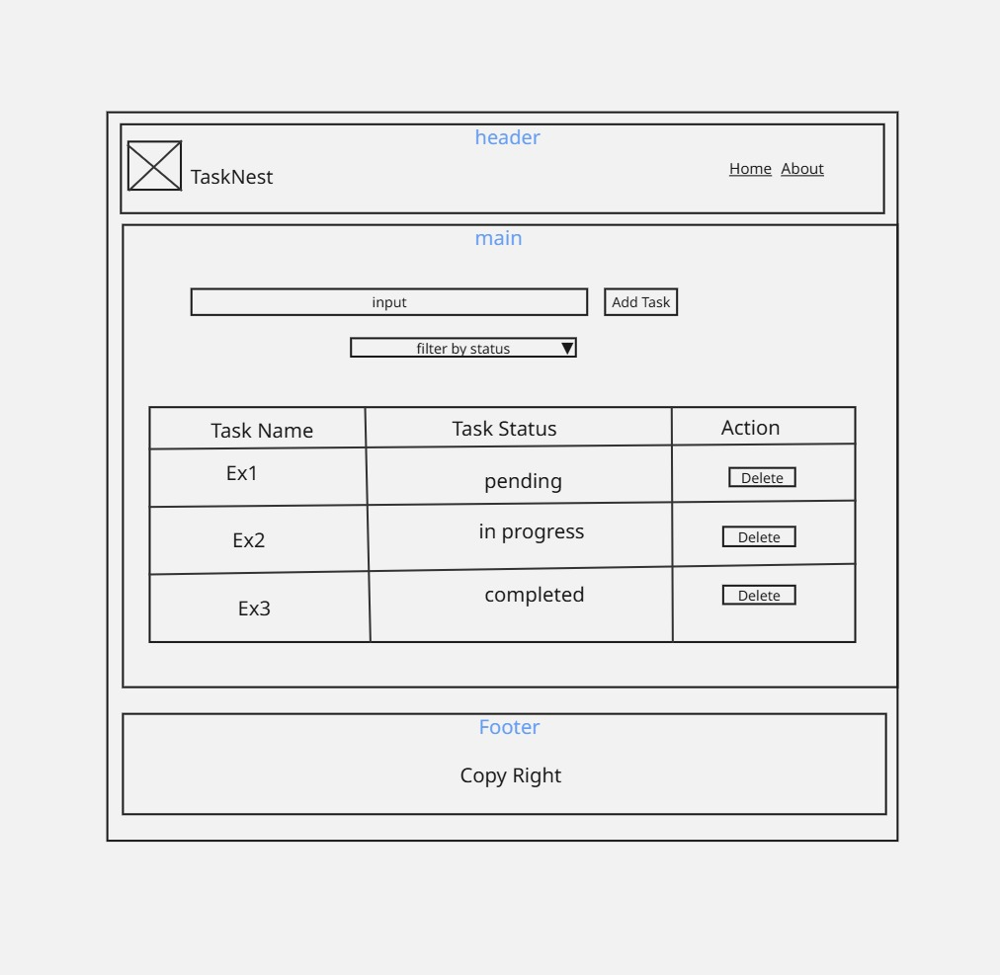
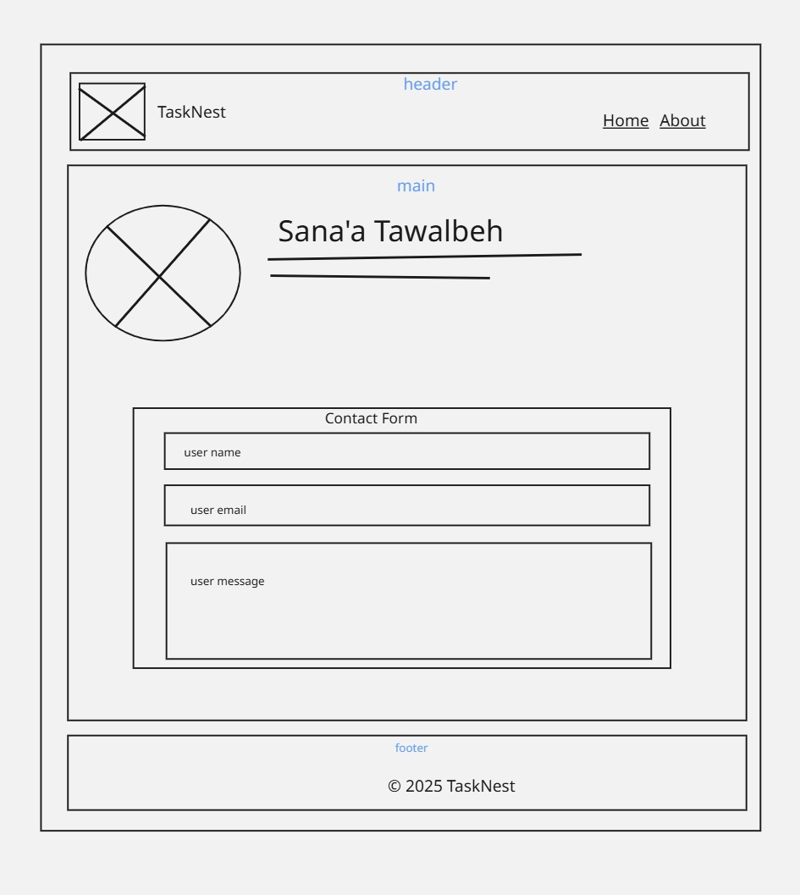

# Lab 02 - My tasks

## Wireframes images

## 1-Home Page Wireframe

## 2-About Page Wireframe

## Q8stions Answe's 

### What observations or questions do you have about what you've learned so far?

I learned how to strucuture a basic HTML page using semetric elements and how to organize content clearly.
I'm curious to learn more about responsive design and best practices for accessibility

### How long did it take you to complete this assignment? And how long did you expect it to take?

I expected it to take about 4 hours but it actually take around 12 hours to completed because i initially thought we were required to include a JavaScript code Akso it's been a while since i last practiced coding.

